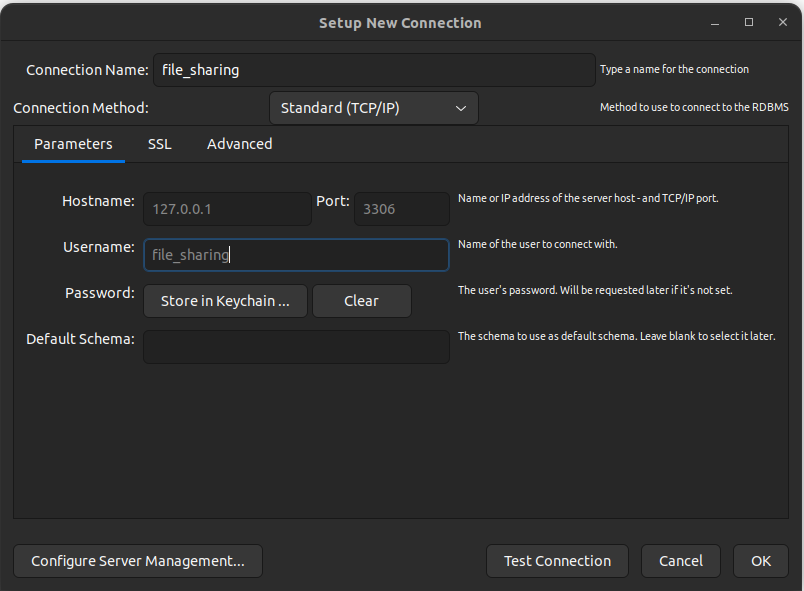

# Secure File Sharing app

# Note
- DB Used: MySQL 8.x
- ~~Backend: Nodejs 19~~
- Backend: Django

- DB/schema.sql: for create table & structure, no data inserted
- DB/data.sql: for insert initial data

- username & password for DB: `root`, db name: `db_test`, host: `mysql_database`
- Using adminer (minimal DBMS) for manage MySQL (using above info) at `localhost:8080`
- ~~MySQL will delete db on close (for development), **this option can be changed!**, changed back only on production (stable schema)~~

- Mysql takes a while to init, chill pls <("), only the first time takes that long.

- You can use adminer to create schema! (Remember to select InnoDB & correct locale on table), then export with option: "create database, drop&create table, ignore data"

- ~~Nodejs should host on port `20222`, debug port default at `9229` (use with vscode debugger)~~
- ~~Moreover, nodejs will use `nodemon`, which will monitor changed files on save, no need to reloading docker (except installing new library with npm)~~
- ~~index.js is not completed, just for demonstrate connection with database! -> may throw error~~


# How to use:

## For Docker setup

- Install docker desktop (windows) & use WSL2 / docker (linux)
- `git clone` this repo (through gui / cli)
- Make sure cloned file are "LF", not "CRLF" (Windows only) !
- `cd SecureFileSharing`
- `docker compose up`
- To end session, `Ctrl-C`
- To cleanup: `docker compose down -v`, this will clean all docker compose volume & container (not recommended due to slow init)

## For MySQL
### Installations
- For Windows users, please download MySQL Workbench from [here](https://dev.mysql.com/downloads/workbench/)
- For Ubuntu users, please follow this [instructions](https://linuxhint.com/installing_mysql_workbench_ubuntu/) to install `mysql` and MySQL Workbench.
- For other operating systems, please find appropriate instructions to install MySQL Workbench.
### Usage
- Create a user named `file_sharing` and password `file_sharing` with all privileges.  
  Commands on Ubuntu:
```
  sudo mysql -u root -p
  CREATE USER 'file_sharing'@'localhost' IDENTIFIED BY 'file_sharing';
  GRANT ALL PRIVILEGES ON *.* TO 'file_sharing'@'localhost';
  exit
```
  For other operating systems, please find appropriate commands to create a user.
- Create a database named `file_sharing` with configurations as in the image below.
  

## For Django

- `cd Backend`
- For Windows user, please manually copy commands from `.sh` files :((
- For the first time setting up backend, run
  ```
    ./pyenv_run.sh
  ```
  to set up virtual environment

- To run server, use:
    ```
    ./server_run.sh
    ```